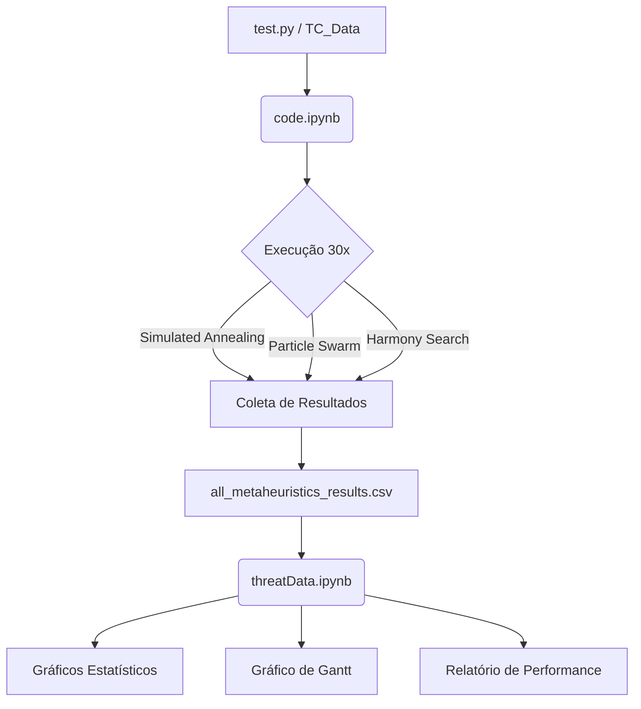

# Guia de Processo: Avaliação de Meta-heurísticas para JSSP

Este documento descreve o funcionamento detalhado dos notebooks utilizados para o experimento de escalonamento de tarefas (Job Shop Scheduling Problem - JSSP) com restrições de disponibilidade e equipamentos.

---

## 1. Notebook de Execução e Coleta (`code.ipynb`)

Este notebook é responsável por carregar os dados, configurar o ambiente de otimização e executar as meta-heurísticas de forma sistemática.

### Passo 1: Configuração do Ambiente
*   **Instalação e Importação**: Carrega bibliotecas como `mealpy` (otimização), `numpy` e classes customizadas do projeto (`jssp`, `job`, `operation`).
*   **Carregamento de Dados**: Utiliza a função `import_tests_cases` para ler instâncias de teste do JSSP a partir de arquivos Python externos (ex: `test.py`).

### Passo 2: Definição da Função de Fitness
*   **Mapeamento de Prioridades**: Como o JSSP possui restrições de precedência rígidas, o notebook utiliza um codificador por prioridade. Cada operação recebe um valor entre 0 e 1, que é ajustado para garantir que a ordem das operações de um mesmo "Job" seja respeitada.
*   **Simulação de Execução**: A função de fitness reconstrói o agendamento em tempo real para calcular o *makespan* (tempo total de execução).
*   **Restrições**: Considera indisponibilidades de máquinas (*downtimes*) e uso de equipamentos compartilhados. Violações geram penalidades no valor de fitness.

### Passo 3: Execução das Meta-heurísticas
O notebook suporta execução individual para testes rápidos ou uma **Pipeline Completa**:
1.  **Iteração**: Percorre automaticamente todos os casos de teste (`TC_MK*`).
2.  **Repetições**: Executa cada algoritmo (ex: SA, PSO, HS) 30 vezes por teste para garantir robustez estatística.
3.  **Persistência**: Salva o identificador da execução, tempo gasto, fitness alcançado e o vetor de solução final em um arquivo consolidado: `all_metaheuristics_results.csv`.
4.  **Automação**: Ao final do processo, dispara a execução automática do segundo notebook via `nbconvert`.

---

## 2. Notebook de Análise e Visualização (`threatData.ipynb`)

Este notebook consome os resultados gerados e transforma dados brutos em inteligência estatística e visual.

### Passo 1: Preparação e Parsing
*   **Parsing de Vetores**: Converte as strings dos vetores de solução salvos no CSV de volta para arrays numéricos.
*   **Métricas de Performance**: Calcula a acurácia em relação ao *timespan* de referência e a "Taxa de Acerto" (percentual de vezes que o algoritmo alcançou ou superou o objetivo).

### Passo 2: Análise Estatística Comparativa
Os dados são agregados em três dimensões:
*   **Por Teste e Algoritmo**: Identifica qual meta-heurística performou melhor em cada cenário específico.
*   **Geral por Meta-heurística**: Ranking global de performance (Acurácia x Tempo x Taxa de Acerto).
*   **Geral por Teste**: Avalia a dificuldade relativa de cada instância do problema.

### Passo 3: Visualização de Dados
Geração de gráficos para facilitar a interpretação:
*   **Heatmaps**: Mostram a acurácia e o tempo médio cruzando testes e algoritmos.
*   **Bar Charts**: Comparações diretas de eficiência.
*   **Gráfico de Gantt Detalhado**: Reconstrói visualmente o melhor cronograma encontrado, destacando:
    *   Alocação de operações em máquinas.
    *   Períodos de indisponibilidade (*Downtime* em vermelho).
    *   Uso de equipamentos.

---

## Resumo do Fluxo de Trabalho

Este fluxo garante que o experimento seja replicável, estatisticamente válido e visualmente explicativo para a análise de problemas complexos de agendamento industrial.
